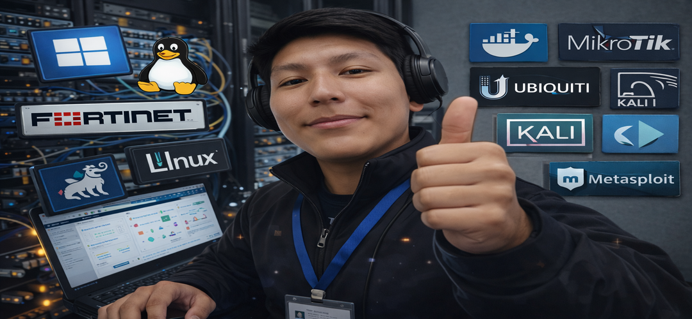

<h1 align="center">👋 Hola, soy Rodrigo Alejandro Peñaloza</h1>
<h3 align="center">Ciberseguridad | Infraestructura IT | Redes | Cloud | Virtualización</h3>

---

## 🌐 Sobre mí  
Me apasiona el mundo de la **ciberseguridad**, la **infraestructura IT**, las operaciones **Red/Blue Team**, y todo lo relacionado con **redes, virtualización, servidores y seguridad perimetral**.

Mi objetivo es seguir creciendo para convertirme en un referente en **seguridad ofensiva, defensiva e infraestructura empresarial**.
## 🛠️ Tech Stack

**Sistemas & Servidores:**  

**Networking & Security:**  

**Cloud & DevOps:**  

---

---

## 🧠 Áreas de Especialización
- 🔥 **Ciberseguridad:** Hardening, SIEM, Pentesting básico  
- 🏢 **Infraestructura IT:** Windows Server, Linux, virtualización VMware, Proxmox  
- 🔐 **Seguridad Perimetral:** Fortinet, Cisco, Mikrotik, Ubiquiti  
- 🌐 **Networking:** VLANs, routing, switching, wireless enterprise  
- ☁️ **Cloud & Virtualización:** Azure, ESXi, OPNsense  
- 📊 **Monitoreo:** PRTG, Zabbix  
- 🛠️ **IT Operations:** Help Desk, automatización, documentación, estándares

---

## 💼 Experiencia Profesional

### 🟩 **Analista de Datacenter - GRUPO SION - KALOMAI HOLDING** 
### 🟧 **Auxiliar de Sistemas y Redes – Tortas Dolly SRL**
### 🟥 **Ingeniero de Soporte – Nexored SRL**
### 🟦 **Técnico de Cableado Estructurado – SACVE SRL**
### 🟩 **Auxiliar de Laboratorios – UAGRM (FICCT)**
---
## 🎓 Educación
- 🎓 **Diplomado en Seguridad Informática** – UAGRM  
- 🏢 **Diplomado en Data Center & Microsoft Azure (DCAAS)** – UDI  
- 🛠️ **Licenciado en Ing. Redes y Telecomunicaciones** – UAGRM  
- 🧩 **Técnico Medio Operador en Sistemas Empresariales** – UAGRM
---

## 📜 Certificaciones
- 🛡️ **EJPT v2 – INE (2025)**  
- 🔍 **Certified AppSec Pentester (CAPen)** – Voucher adquirido  
- 🏅 **Cisco Cybersecurity Analyst (Junior)**  
- 💼 **Google Cybersecurity**  
- 🔥 **Fortinet NSE1, NSE2, NSE3**

---

## 🎯 Aspiraciones Profesionales
- ✔️ ISO/IEC 27001:2022 Lead Auditor — Certiprof  
- ✔️ ECPPT Certification — INE  
- ✔️ Especialización en Operaciones de Seguridad, Pentesting y Cloud Security

---

## 🌎 Idiomas
- 🇺🇸 Inglés Intermedio (B1 – 7mo módulo, C.A.I.)

---

## 📫 Contacto
📍 Santa Cruz, Bolivia  
📧 **alejandropenaloza9@gmail.com**  
📱 **+591 76394464**  
🔗 **LinkedIn:** *(aquí agregas tu enlace)*  
📝 **Notion / Portfolio:** *(opcional)*  

---

## ⭐ Filosofía Profesional
> “La ciberseguridad y la infraestructura no son solo herramientas,  
>  son el esqueleto que sostiene a toda empresa moderna.”

---

<h3 align="center">Gracias por visitar mi perfil 🚀</h3>
